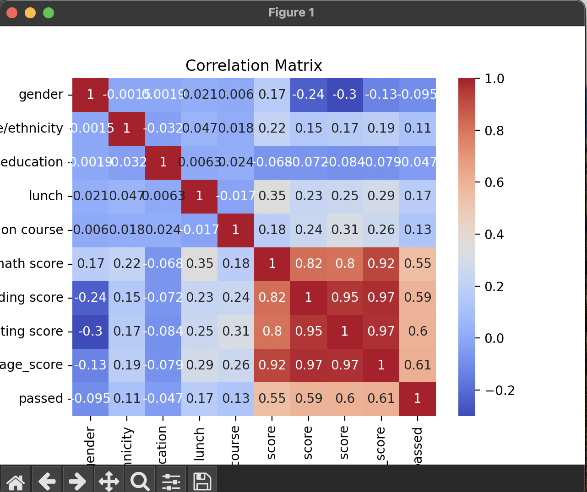
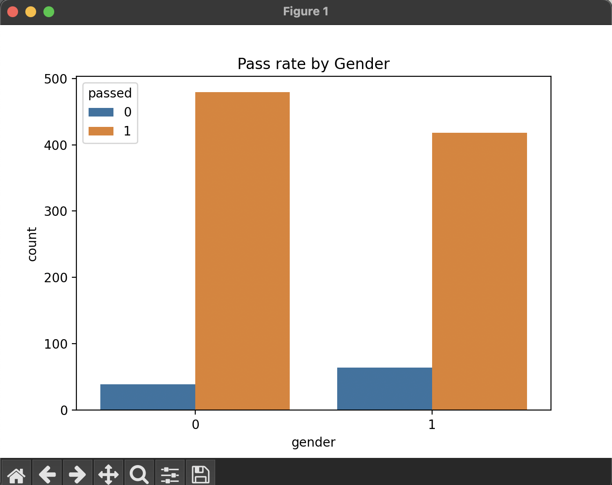
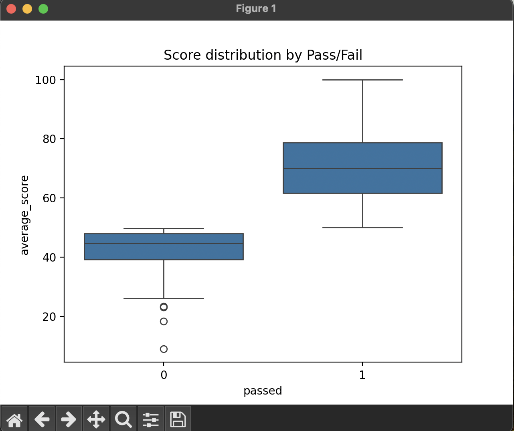

# 📊 Student Performance Analysis

This project analyzes student exam performance data using Python.
It explores relationships between gender, parental education, test preparation, and exam scores.
It also includes a basic machine learning model to predict whether a student passed or failed based on their scores and background.

---

## 📁 Dataset
- **Name:** StudentsPerformance.csv
- **Source:** [Kaggle - Student Performance Dataset](https://www.kaggle.com/datasets/spscientist/students-performance-in-exams)

---

## 🧠 Technologies Used
- Python 3.x
- Pandas
- NumPy
- Matplotlib
- Seaborn
- Scikit-learn

---

## 📊 Project Highlights
- Data cleaning and transformation
- Exploratory Data Analysis (EDA)
- Visualizations (bar plots, boxplots, heatmaps)
- Logistic Regression Model
- Model evaluation using accuracy, precision, recall, F1 score

---

## 🚀 How to Run

python -m venv venv
source venv/bin/activate        # On Windows: venv\Scripts\activate

pip install -r requirements.txt

python student_analysis.py





### 📦 1. Clone this repo:
```bash
git clone https://github.com/Kartik0211/student-performance-analysis.git
cd student-performance-analysis
